# DAZ Studio to Blender to Godot Game Engine Guide

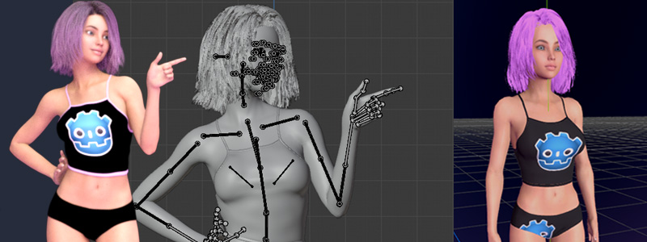

This guide shows the basic workflow how to get DAZ Studio characters with morphs and Mixamo animations inside the Godot Game Engine.

The guide was made for Godot3 and Blender2.8 and is no longer updated.
At time of last updating this the general steps are still almost all the same in newer versions.

- Import of fully equiped DAZ Studio Genesis 8 characters to Blender
- Import of morphs and facial animations and small optimizations
- Switch to Rigify for a proper animation rig
- Import and retargeting of Motion Capture data from Mixamo
- Export of the finished and gameplay ready model to Godot

All required tools to follow this guide are freely available except that DAZ Studio requires a registration. This doesn't mean that you can use the 3d assets for a release game without purchasing licenses. All legal responsibilities are yours.

A basic knowledge how to navigate DAZ Studio, Blender and Godot or 3D space in general is assumed to follow along.

## Tools needed:

DAZ Studio 4.12 https://www.daz3d.com/

Blender 2.82a https://www.blender.org/

Blender Addon - DAZ Importer 1.4.1 http://diffeomorphic.blogspot.com/p/daz-importer-version-14.html

Blender Addon - BVH Retargeter 2.0 http://diffeomorphic.blogspot.com/p/bvh-retargeter.html

Blender Addon - glTF 2.0 format exporter (build-in)

Blender Addon - Rigify (build-in)

Blender Addon - Godot Engine exporter https://github.com/godotengine/godot-blender-exporter

Make sure all tools work by following all their respective first-time setup and installation guides. Use newer versions at your own risk. Working with 3d models and many import/export steps is a constant mindfield with toolsets breaking left and right with each update.

## DAZ to Blender to Godot workflow:

### Step 1
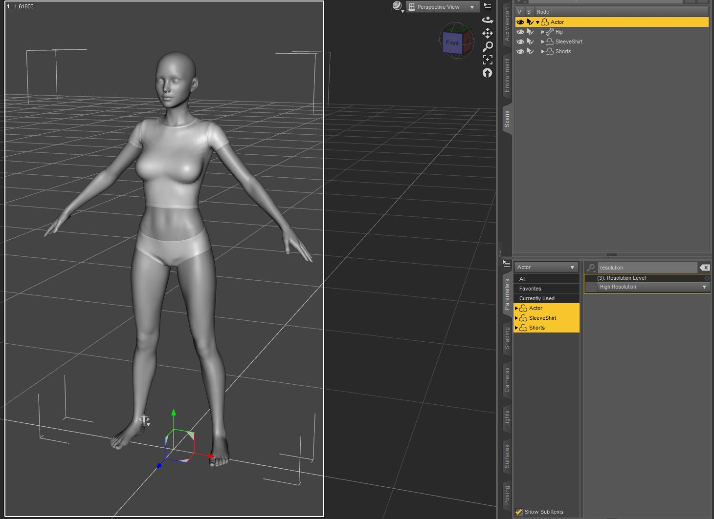

In DAZ Studio prepare and equip your character how you see fit. Save the scene as a normal DAZ Studio file. Don't bother to much about textures and Iray shaders. At best Godot will create a mess out of them. You will have to set them manually inside Godot later. If you overwrite your textures with just some plain and different colors to keep groups apart you will speed up both import/export processes significantly.

### Step 2
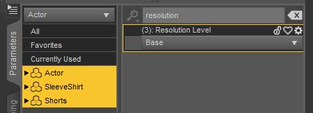

After saving the scene as a DAZ studio file change the resolution level of all your meshes from "High Resolution" to "Base" for the export data ( or risk smoothing deforms in Blender ).

### Step 3
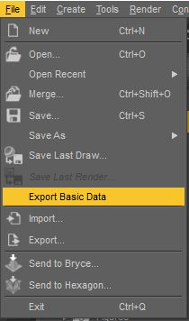

Export the basic scene data which creates a json file so your meshes are fitted and weighted to your character shape inside Blender. If you are missing this export option the DAZ Importer plugin wasn't installed properly.

### Step 4
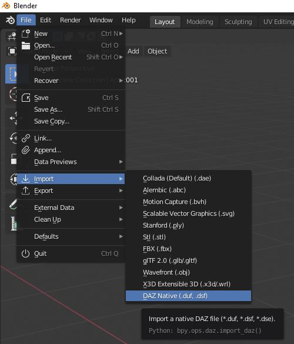

In Blender import the saved DAZ Studio scene file ( not the basic data file ).

### Step 5
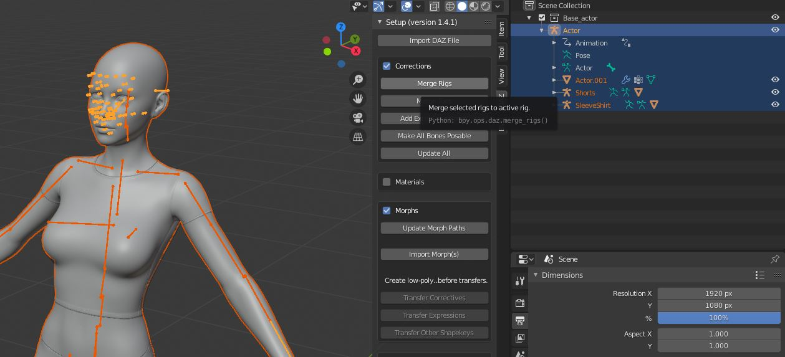

After import you will see that all clothing meshes have their own skeleton/armature. Usually this is redundant so we merge them. If you don't need bones for detailed toe animations cause you character wears shoes merge them as well.

### Step 6
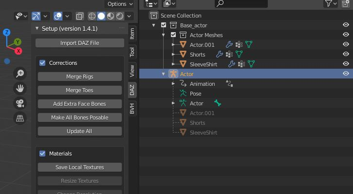

The merge process also moves your meshes to a different collection. This allows you to disable them at will for better animation performance in Blender ( but don't forget to turn them on for export ).

### Step 7
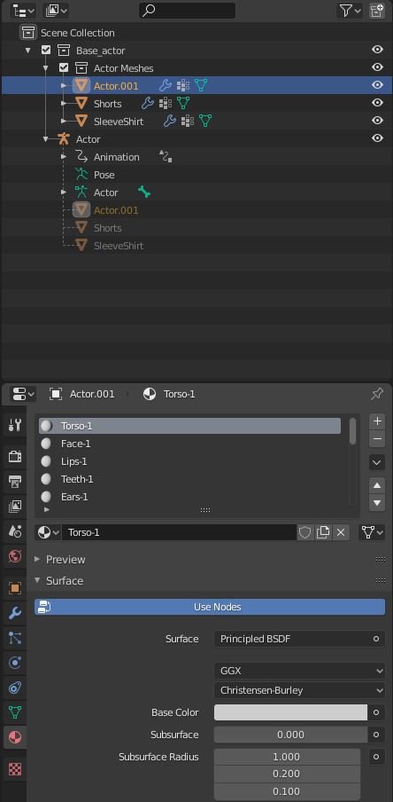

Now is time to look through all the materials. DAZ is often very generious with material groups but each of those vertex groups will turn into a material slot in Godot. It is a good idea to reduce duplicates as they affect performance and clutter the inspector in Godot. The DAZ Importer has a "Merge Materials" option in the "Materials" tab that might speed up the process for you ( only works well when you load with textures ).

### Step 8
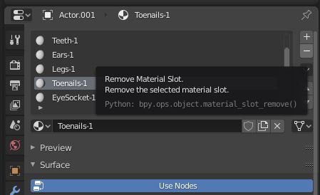

To merge material groups move the group that you want to merge below the group that you want to keep and click the "Remove Material Slot" button. A typical Genesis 8 character has redundant groups for hands and fingernails, same for feet and toenails. There are many other examples where combining groups into just one group is a good idea. You can achieve the same customization option with a simple mask shader inside Godot.

### Step 9
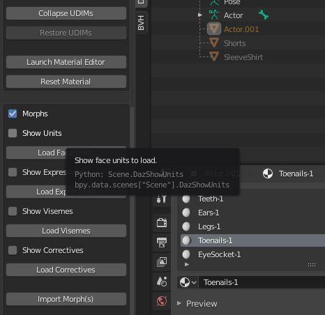

Before we look at blendshapes/morphs/shapekeys for body or facial a fair warning. This step can only be done without altering the model, e.g. decimate it for LOD groups. If you want to use Rigify for animation load the blendshapes first or risk deformations. Technically it is not impossible to do everything later but it will turn into a chore so better decide which morphs your character needs upfront.

Start by selecting only your Genesis 8 mesh. We will first load morphs on the characters skin and later copy these morphs to the other equiped items. For Godot facial morphs you will find most of them inside the "Face Units" and "Visemes" categories of the DAZ Importer menu.

### Step 10
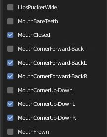

Don't pick the combined names as they are drivers for a combination of morphs and don't work in Godot. Pick the real morphs that are usually below and have a L(eft) or R(ight) in their name. Some of the DAZ morphs use values below 0.0 or above 1.0. Godot will clamp all  values to the 0.0-1.0 range on import and discard the information outside. If you want to use this misfit morphs regardless you need to pick up a tutorial how to work with blendshapes inside Blender to put them into the 0.0-1.0 range.

If that annoys you you might want to push the issue:
https://github.com/godotengine/godot/issues/36707

### Step 11
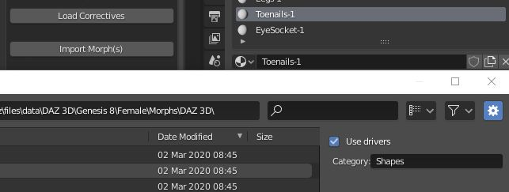

For most other morphs like full bodyshapes, use the "Import Morph(s)" button and pick them from your DAZ .dsf files. You find many of them in your DAZStudio/data/daz 3d/Female_or_Male/Morphs/DAZ 3D/.. folder.

### Step 12
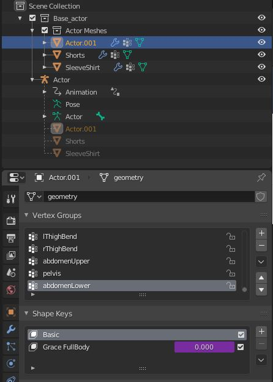

If the import was successful you will find the morph under shape keys in Blender. The color signals that this blendshape is controlled by a Blender Driver.

### Step 13
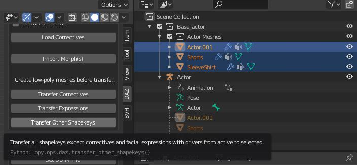

Now that you have all morphs on your Genesis 8 mesh select all the other meshes and use the "Transfer Other Shapekeys" Button ( you don't need facial expressions on clothes, or do you? ). If everything worked fine you will see all the applicable (e.g. upper body morph wouldn't be applied to feet ) shape keys on all your selected meshes except for most facial morphs.

### Step 14
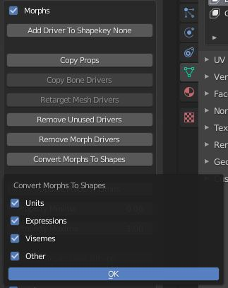

Genesis 8 characters use bones in combination with blendshapes for all facial animations. That is why you can't see most facial morphs in the shape key category. If you move one of the facial sliders a Blender Driver will take over and change bones and morphs for you. This automatic behaviour is limited to Blender and doesn't import to Godot.

If you want to keep it that way you will need to keyframe your facial animations in Blender before you export to Godot. In Godot you would need a script that keeps animation player keyframes and blendshape values in sync. The alternative is to convert facial morphs to pure blendshapes with the "Convert Morphs To Shapes" button. Mind you this is a tradeoff in control and quality but makes less work. Most modern 3d games use bones for facial animation combined with correction blendshapes for small parts in the face.

### Step 15
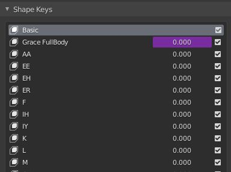

As an example here are all "Visemes" facial morphs converted into blendshapes. These converted facial "animations" can now be controlled through code in Godot without the need to combine them with bone animations.

There are now tons of possible options to optimize your character for performance which is a large topic on its own and often depends on your gametype. We will skip this part and go directly to Rigify and animations

### Step 16
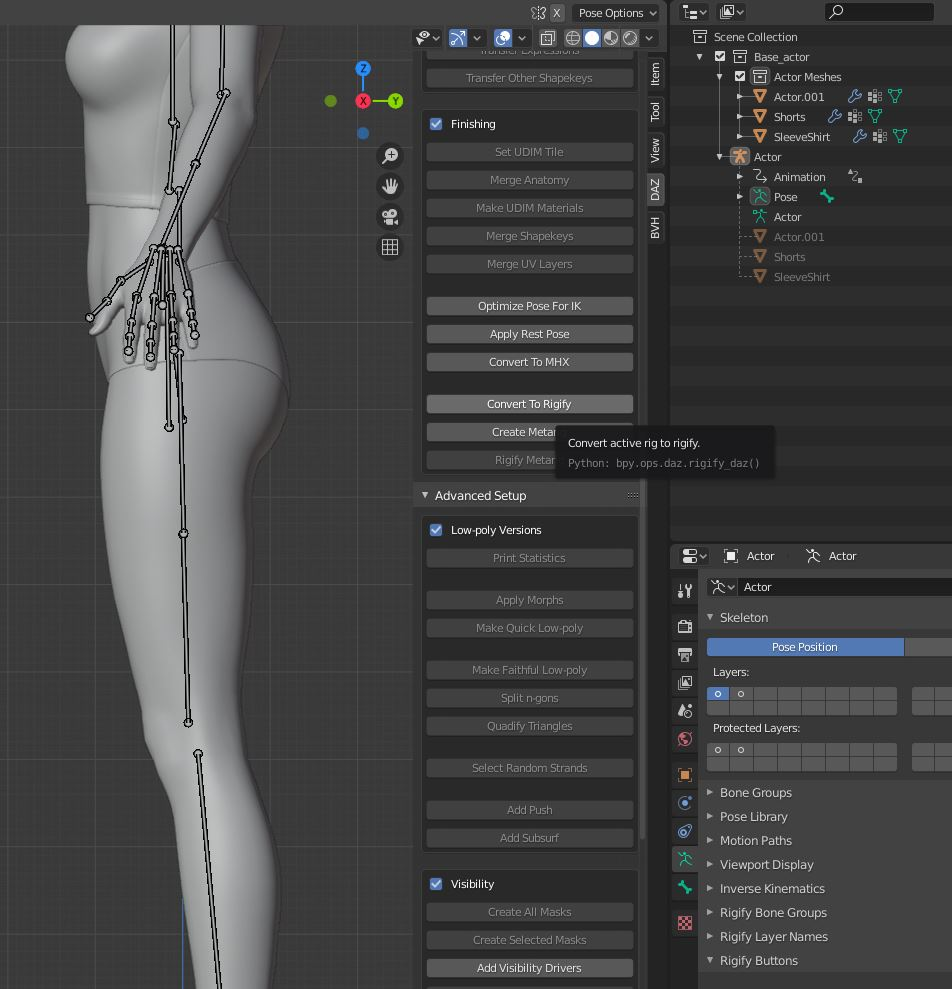

Converting characters with the DAZ rig to Rigify is just a press of a button. Still, small issues might show up with the Inverse Kinematic (IK) bending the legs in the wrong direction. The typical DAZ figure has a rest/t-pose that makes it hard for Rigify to setup the IK correctly cause the leg bones are to straight.

### Step 17
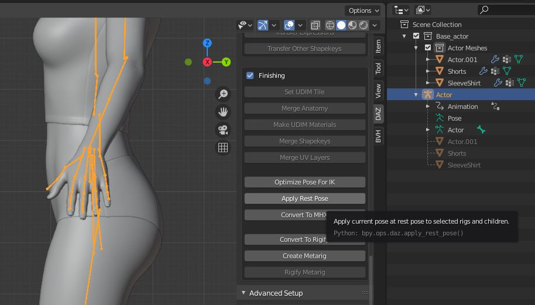

The following bone correction breaks pose loading from the DAZ Importer but Rigify does this anyway so we don't care. Press "Optimize Pose For IK" and "Apply Rest Pose" which moves and saves the legs in a better position for the Rigify Inverse Kinematic. Now press "Convert To Rigify".

### Step 18
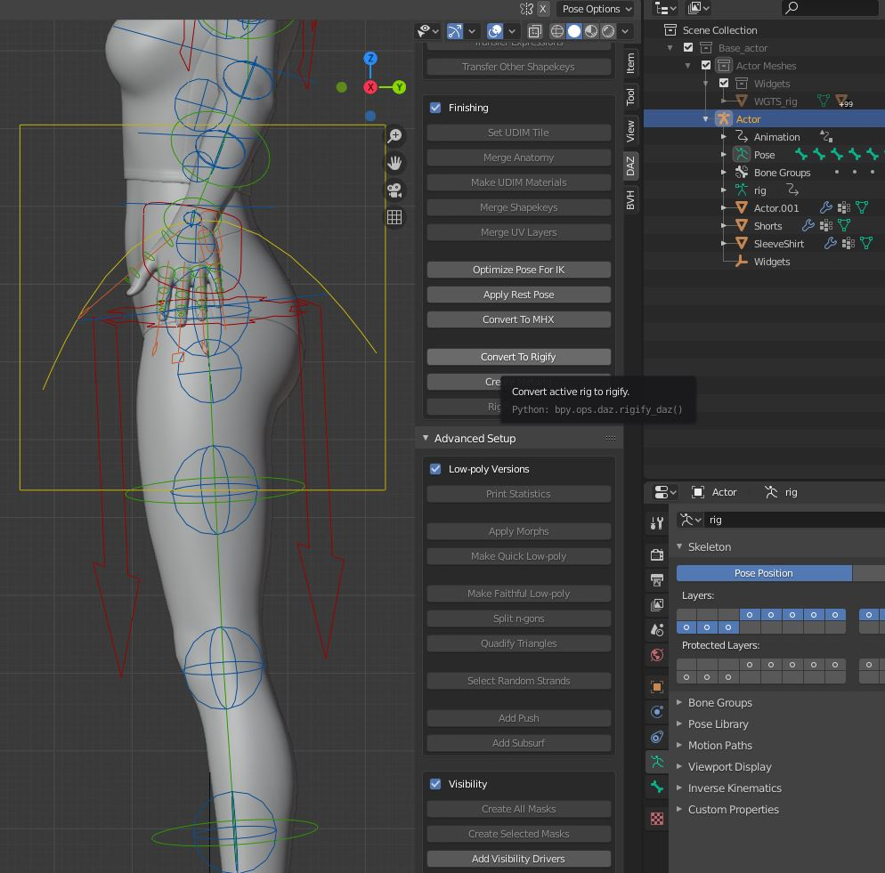

You will see that the display for all character bones has changed significantly. Don't worry, the bones are not lost but hidden and now controlled with the Rigify animation rig.

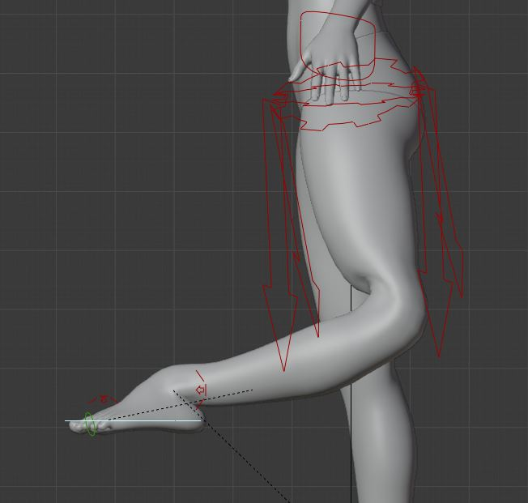

Test the legs with the red IK bones and see if everything works. If the leg bends in a very unnatural way it is time to reverse a few steps. Try to rotate your leg bones again a bit into a better rest position for the IK and use the Rigify button again. If you can't solve it in this way you need to correct the Rigify IK bones directly with the help of another Blender tutorial.

### Step 19
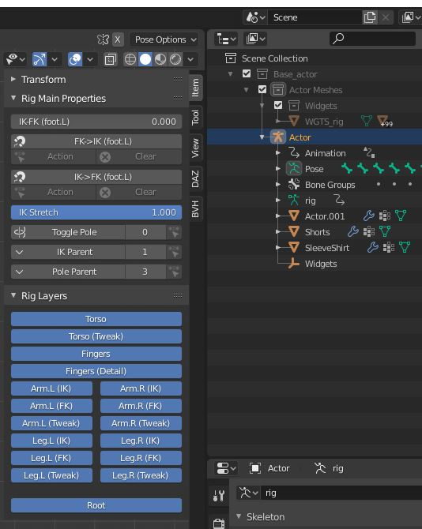

You find the Rigify menu in the item tab. For a realistic human character I suggest to deactivate the stretch values on the IK legs and hands or else you will face cartoonish moves.

### Step 20
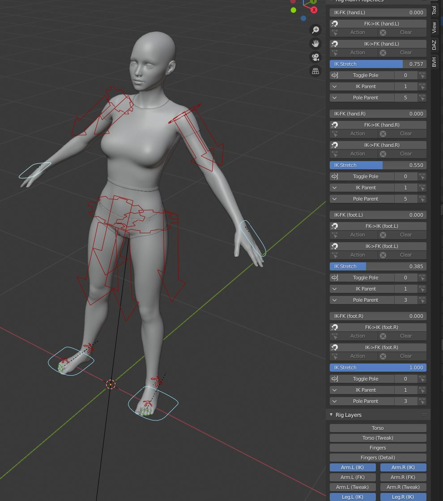

Select the 4 major IK bones at the end of the feet and hands and turn the "IK Stretch" values down to zero.

If you didn't already ... SAVE! If you ever lose your animation rig you will shed tears so it is not inappropriate to make multiple copies. Now have fun animating your character in blender with Rigify.

### Step 21
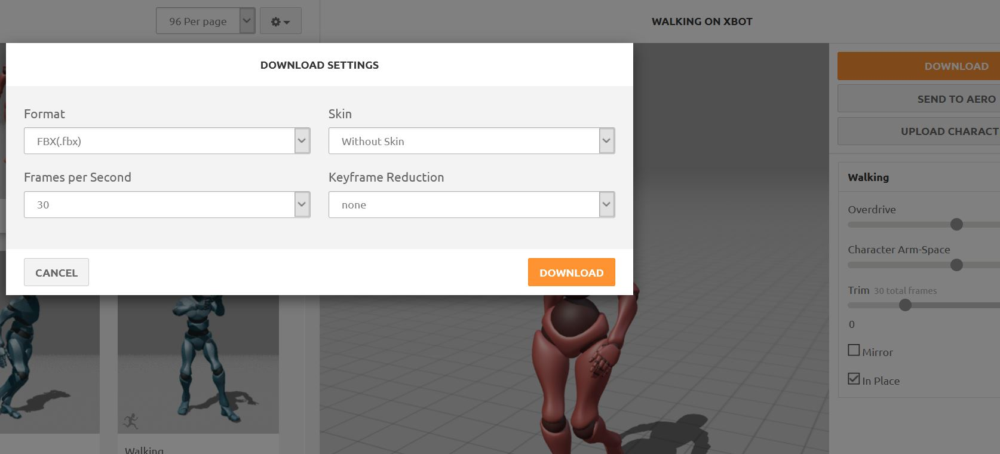

I get you, animating a character even with an animation control rig already set up is hard work. Thats why most animation beginners start out with Mixamo animations for their games ... you shouldn't be ashamed to do the same. Go to www.mixamo.com and download some basic animations. We will retarget them on our DAZ character and import them to Godot. The character doesn't really matter as long as it is a human shape as we wouldn't use the mesh. Default Y-Bot for male and X-Bot for female works well for most animation cases. Download as FBX file with 30 fps, without skin and with the animation in place checked ( cause root motion is broken ).

### Step 22
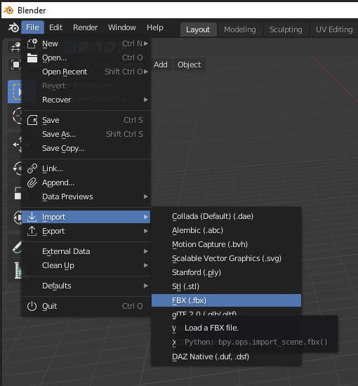

Open a second blender and import the Mixamo FBX file with default settings.

### Step 23
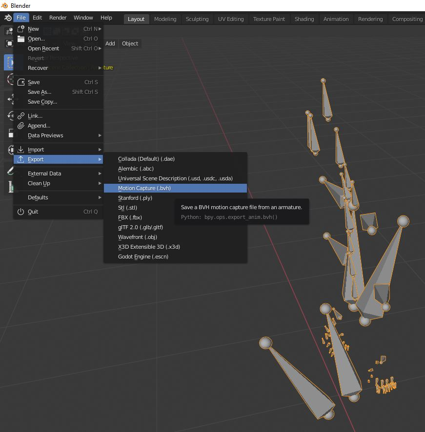

FBX is a bad format on so many levels so export the pure animation as an BVH motion capture file and close the second Blender again.

### Step 24
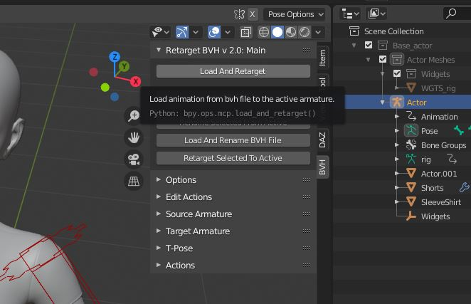

Back in our main Blender select our actor, switch to the "BVH" Tab and use "Load And Retarget".

### Step 25
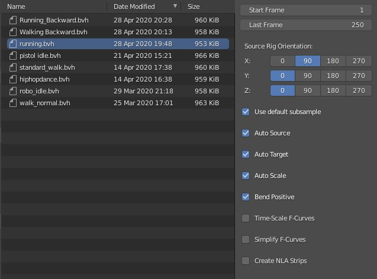

Pick the exported BVH file and watch the magic. Since we used Rigify and a DAZ skeleton the BVH retargeter already knows what to do and autodetects more or less everything for us. If you still encounter errors (no magic?) you might want to take a closer look at the retargeter options.

### Step 26
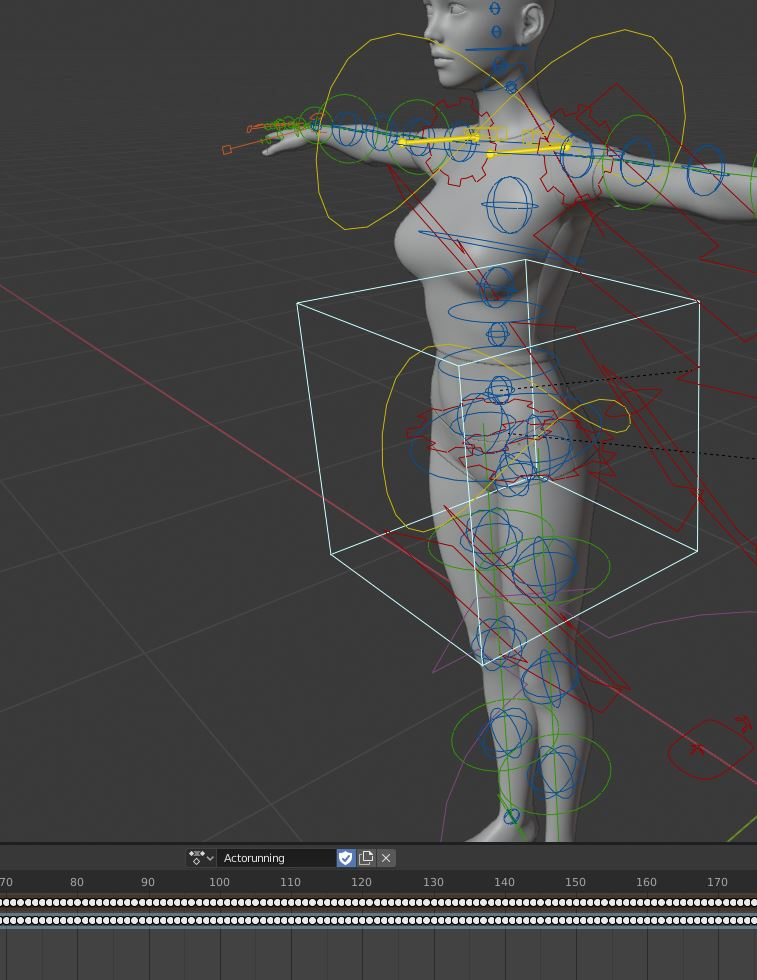

Motion capture data and animation retargeting never works perfect. Most Mixamo animations have the character origin shifted somewhere in the air with the IK bones left behind. To fix this go to the Animation tab and look for the first keyframe of the new animation Action. Select the yellow Rigify hip bone that moves your entire character and also select the first keyframe. You will see that the transform location is somewhere but not at the scene origin.

### Step 27
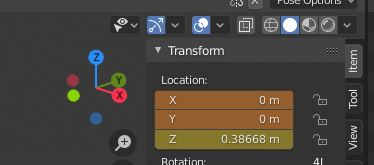

With the hib bone still selected reset the xyz transform locations all to zero and overwrite the keyframe.

### Step 28
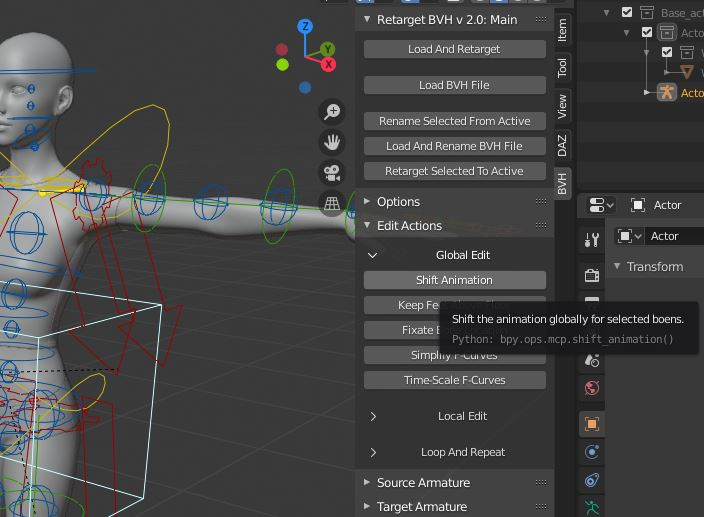

With the hip bone and the first keyframe still selected press the "Shift Animation" button in the "Global Edit" tab of the retargeter. Make sure that Blender autokeying is turned off. If everything works fine our character is back in place for the full animation. For some animations the first keyframe isn't enough and the character is still floating on the second or even third keyframe. Repeat the correction process starting from the first wrong keyframes multiple times until it is solved. The same process can also be used to fix all kind of animation orientation issues with the character.

### Step 29

Our character is back in place at the scene origin. Since we didn't care about the settings when we imported the motion capture file we have a large number of more or less pointless keyframes in our animation. Select all our bones, click in the animation Action timeline and select all keyframes (Shortcut A). Go to the "Key" tab and select "Clean Keyframes" ... our animation  is trimmed back to the real animation length from Mixamo.

### Step 30
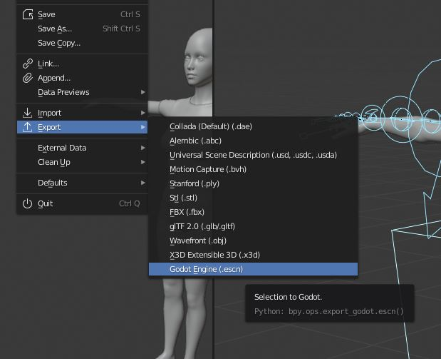

Now that you have stock animations ready you could customize the animations further or start to export them to Godot. At the time of writing this guide all export options to Godot are a mess. The Godot Blender Exporter and glTF 2.0 work fine in most cases but FBX is unusable. You should always try all exporter options and see what works best as they are updated constantly.

### Step 31
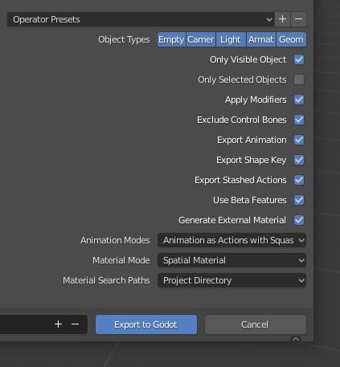

Godot .escn Exporter is faster than glTF 2.0 on export and creates our blender skeleton more or less faithfully in Godot. Blender Materials don't transfer well to Godot. You might want to switch the "Material Mode" to "Spatial Material" to avoid the "Script Shader" bloated mess. The spatial setting has no real support rightnow and will import empty materials inside Godot which are a perfect startingpoint for a manual material setup.

### Step32
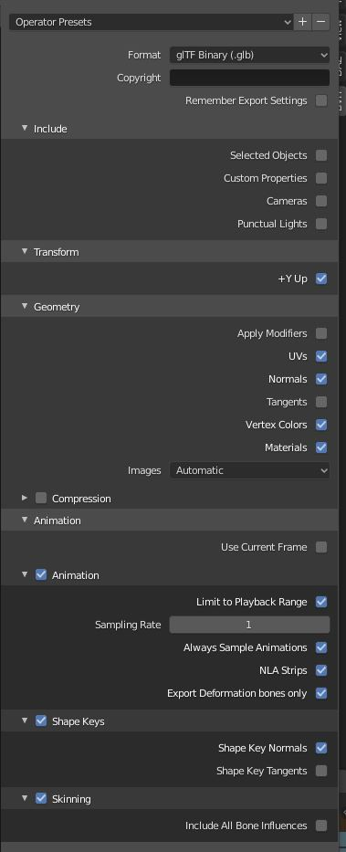

The glTF 2.0 exporter is incredible slow with meshes that have blendshapes ... still, if the Godot Exporter breaks for your model this is the only other option that somehow works for now. Make sure you turn on "Export Deformation bones only" or you end up with a messy skeleton in Godot that has all the Rigify animation control bones included.

### Step 33
If you save the exported file into your Godot project the importer should already do his job and import the mesh with blendshapes, materials and animations. You can open the file ( open, not inherite ) and inspect that everything is in order. If you test the blendshapes beware that you can't properly select them all at ones to adjust the sliders.
https://github.com/godotengine/godot/issues/35934

Do yourself a favour and save the exported 3d file to a new .scn binary file or otherwise save/load times and filesize will be very slow.

If you want seperate mesh, material and animation files you have two options. Save them manual from the open scene or create them automatically by reimporting with different importer settings, see the Godot Import documentation.

If all went well you have your fully equiped, morphable and animated DAZ character inside Godot. Yee! Congratulation!

## License
MIT

## Common errors:

### Blendshapes are missing
If your model misses blendshapes go back to Blender and make sure that you have checked "shape keys" in the export settings. If you have edited your mesh in blender or used mesh modifiers you can't export the blendshapes. Export formats like FBX and Collada are broken for blendshapes rightnow.

### Animations are missing
If your model misses animations make sure that all animation Actions in Blender have a "Fake User" and/or are "stashed" in the "NLA Strip" of Blender. If you don't know what all this Blender buzzwords mean ... well, welcome to blender animation hell. Best google the terms and watch tutorials that explain it way better.